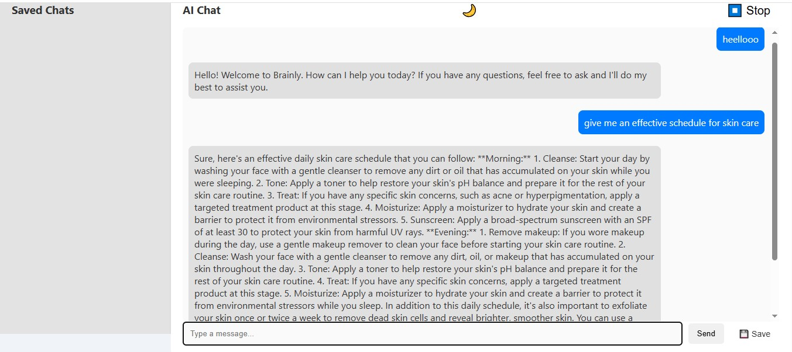

# generative-aii
Conversational AI Chatbot using Generative AI
This project is a Generative AI-powered chatbot designed to simulate intelligent, human-like conversations across various everyday topics such as food, fashion, and lifestyle. Built using Python, Hugging Face Transformers, and Streamlit, the chatbot provides context-aware responses and can engage users in natural dialogue.

 Features
🧠 Powered by pre-trained transformer models (e.g., GPT-2)

🥘 Responds to food-related queries (e.g., recipe suggestions like Podi Dosa)

👗 Offers fashion advice based on dress codes

💬 Capable of casual lifestyle conversations

⚡ Built with Streamlit for a simple, interactive web UI

Tech Stack
Python 3.10+

Hugging Face Transformers

Streamlit

Pre-trained GPT models

 How to Run
Clone the repo

bash
Copy
Edit
git clone https://github.com/your-username/genai-chatbot
cd genai-chatbot
Install dependencies

bash
Copy
Edit
pip install -r requirements.txt
Run the app

bash
Copy
Edit
streamlit run app.py

Sample Output
👤 User: How do I make podi dosa?
🤖 Bot: Sprinkle some podi (gunpowder) over the dosa... (gives full recipe)

👤 User: How should I dress up?
🤖 Bot: The appropriate dress code can depend on many factors... (gives categorized fashion tips)

Project Objectives
Explore how Generative AI can simulate human-like conversations

Leverage pre-trained NLP models to generate dynamic text

Provide an accessible, topic-flexible AI companion

🏁 Final Deliverables
Complete source code

Sample interaction screenshots

Functional web chatbot interface
## 📸 Sample Output

🧠 *This screenshot demonstrates the chatbot generating a relevant response to the user’s query using a GPT-based model.*
